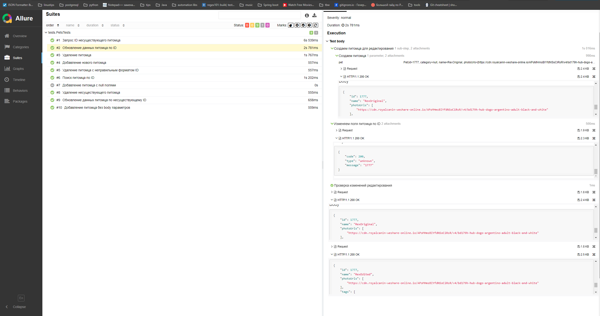

## Автоматизация тестирования api-сервиса <a href="https:\\petstore.swagger.io"> petstore.swagger.io  <a/>


## Содержание:

- [Стек ](#стек)
- [Проверки](#готовые-проверки)
- [Запуск тестов](#запуск-тестов)
- [Билды в Jenkins](#Инфраструктура-в-jenkins)
- [Allure-репорты](#allure-репорты)


## Стек

<p align="center">


</p>

Тесты написаны на <code>Java 17</code> с <code>JUnit 5</code> и <code>Gradle</code>.

Для API тестов <code>REST Assured</code>
Запуск тестов локальный и на Jenkins.

Jenkins развернут в <code>Docker</code>
Подключена конфига в <code>Jenkins</code> с формированием Allure-отчета.

## Готовые проверки

- GET /pet/{petId} - получение pet по petID, положительные и негативные кейсы
- POST /pet - создание записи pet , положительные и негативные кейсы (в сервисе найден баг, позволяющий создать запись со всеми null, и получить Id)
- POST /pet/{petId} - апдейт записи pet по petId, позитивные и негативные кейсы
- DELETE /pet/{petId} - удаление записи pet по petId, позитивные и негативные кейсы


## Запуск тестов

Локальный и Jenkins параметр запуска тестов (Gradle)
```
./gradlew clean test
```


## Инфраструктура в Jenkins
<p align="center"></p>

## Allure-репорты
С детализацией шагов и содержимым HTTP запросов/ответов
<p align="center">
 
</p>

### Main Page

<p align="center">

</p>


